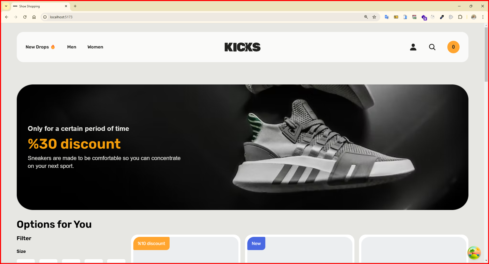

<h1>My Shoe Shopping App - Typescript & ReactQuery </h1>

In this project, I developed a shoe shopping website using modern web development technologies, including TypeScript, React (with Vite), TanStack React Query, @uidotdev/usehooks, React Router DOM, Axios, Json-Server, React Icons, and Tailwind CSS. The goal of the project is to create an e-commerce platform that enhances the user experience by optimizing filtering, detail inspection, and overall shopping.

All shoe data is sourced from a simulated backend API utilizing Json-Server. API calls are managed using Axios and TanStack React Query to improve data handling efficiency. 

Products are categorized based on the `isNew` value, and new shoes are labeled with a "New" tag. If shoes are on sale, the discounted price is calculated using the discount rate and displayed alongside the original price, clearly indicating the discount percentage.

Users can filter shoes by size, color, gender, and price, making it easier to find desired products. Each product has a dynamic detail page, which is managed using React Router DOM. This page displays important information such as the product name, description, price, available colors, and sizes. Sizes that are out of stock are shown in a dimmed state and are unclickable.

The interface is modern, responsive, and designed for user-friendliness, thanks to Tailwind CSS.

<h2> The following technologies were used in the frontend development phase of my site: </h2>

- TypeScript
- React (Vite)
- React-Router-Dom
- Tanstack React Query 
- @uidotdev/usehooks
- Axios
- Json-Server
- React-Icons
- Tailwind Css

<h4>GIF</h5>

<h4>IMAGES</h4>

<h5>Main Page</h5>

<h5>Filter & List Page</h5>

<h5>Detail Page</h5>

<h5>Mobile</h5>

